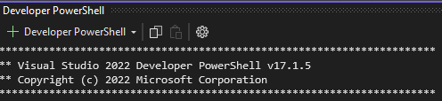
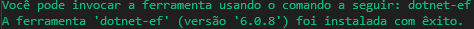
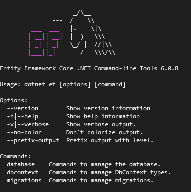
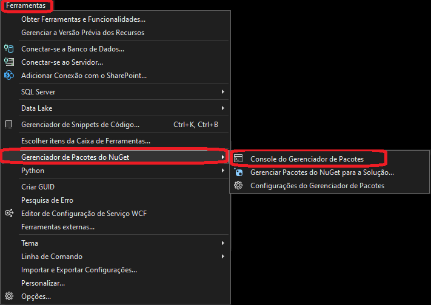
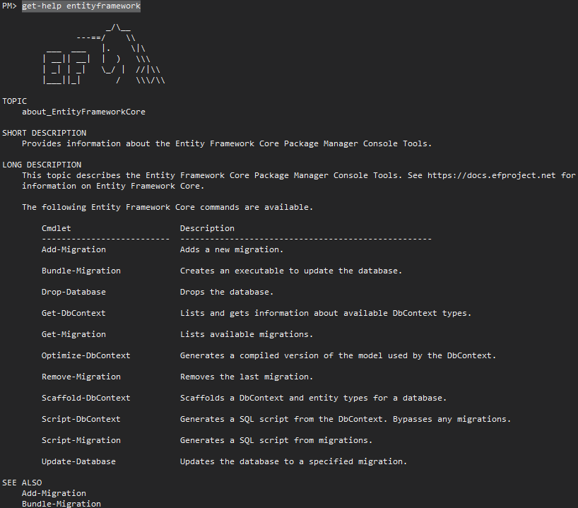

## Entity Framework Commands (PowerShell)
<br />

To open the terminal within Visual Studio: ``CRTL + ` `` 
<br />

***

Install: ``dotnet tool install --global dotnet-ef``
<br />

***

Uninstall: ``dotnet tool uninstall --global dotnet-ef``
<br />

***

See installation details: ``dotnet ef``
<br />

***

Create Migrations: ``dotnet ef migrations add MyFirstMigrations``
<br />
***

Create SQL Script by Migrations: ``dotnet ef migrations script -o MyFirstMigrations.sql``
<br />
Use the parameter ``-i`` to generate the idempotent SQL Script
<br />
***

Execute Migration on database: ``dotnet ef database update -v``
<br />
***

Rollback / revert Migrations: ``dotnet ef database update MinhaTargetMigrationRollBackName``
<br />
***

Remove last migrations: ``dotnet ef migrations remove``
<br />
***

## Entity Framework Commands (NPM - Package Manager Console command)
<br />

To open the console in Visual Studio, go to the main menu and select ``Tools > NuGet Package Manager > Package Manager Console command.``
<br />

***

View the Entity Framework migration command list: ``get-help entityframework``
<br />

***

## C# quick tips
Execute Migrations by code: 
```
using Microsoft.EntityFrameworkCore;
...
using var context = new ApplicationContext();
context.Database.Migrate();
// or
// await context.Database.MigrateAsync();
```
***

Get Pending Migrations:
```
using Microsoft.EntityFrameworkCore;
...
using var context = new ApplicationContext();
context.Database.GetPendingMigrations();
// or
// await context.Database.GetPendingMigrationsAsync();
```
***